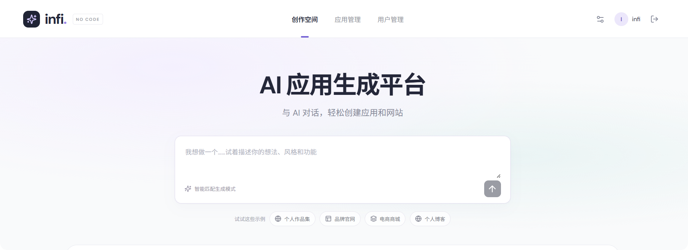
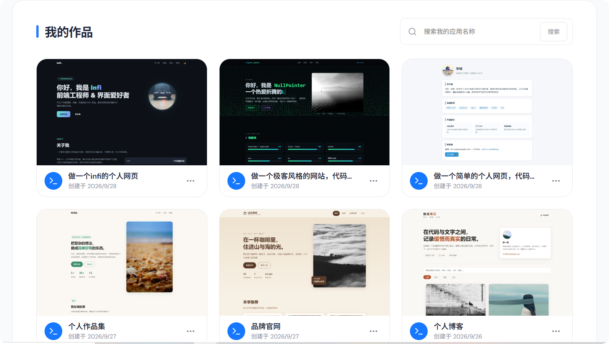
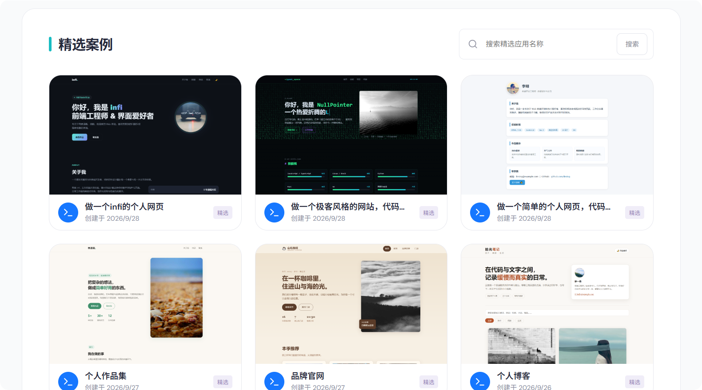
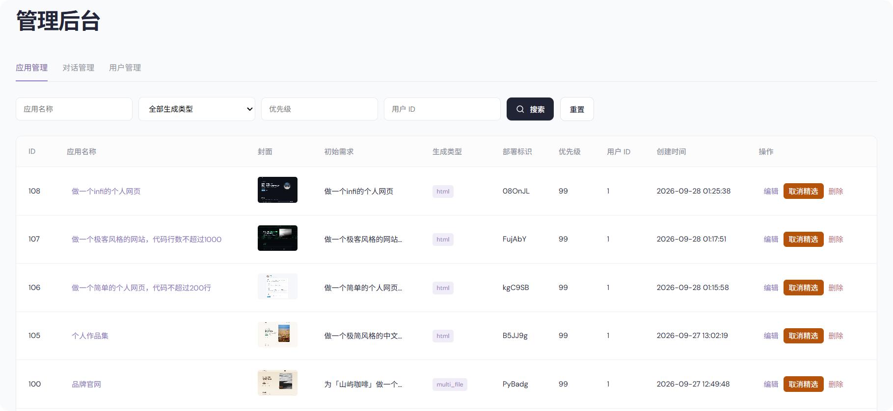
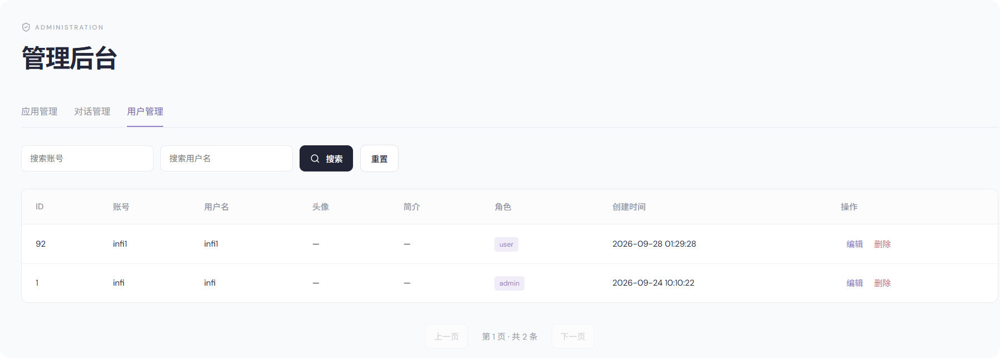

# Infi NoCode · AI 零代码应用生成平台

用自然语言创建网站，支持多轮对话修改、实时生成进度、源码查看、预览、发布和封面截图。

从一句想法到可预览的前端应用：**描述需求 → AI 生成 → 对话调整 → 预览检查 → 发布网站**。适合制作个人作品集、品牌展示页、活动页，以及带交互的轻量前端工具。

技术栈：**Java 21、Spring Boot 3.4.1、MyBatis、MySQL 8.x、Redis 7.x、LangChain4j、Vue 3.5、Vite 8、Knife4j**。前后端独立运行，不使用 Docker。

## 导航

- [界面预览](#界面预览)
- [已实现功能](#已实现功能)
- [三种生成类型](#三种生成类型)
- [项目结构](#项目结构)
- [运行环境](#运行环境)
- [首次初始化](#首次初始化)
- [创建第一个应用](#创建第一个应用)
- [构建与测试](#构建与测试)
- [部署到阿里云（宝塔面板）](#部署到阿里云宝塔面板)
- [部署注意事项与当前边界](#部署注意事项与当前边界)
- [常见问题](#常见问题)

## 界面预览

以下界面展示了从首页创作、作品浏览到后台管理的主要功能。

### 创作首页

输入网站用途、风格和功能要求，也可以选择个人作品集、品牌官网、电商商城或个人博客等示例开始创作。



### 我的作品

以卡片方式浏览已创建的作品，查看网站封面、应用名称和创建日期，并按名称搜索应用。



### 精选案例

浏览平台精选应用，通过作品封面了解不同风格的网站效果，也可按应用名称搜索案例。



### 应用管理

管理员可按应用名称、生成类型、优先级和用户 ID 筛选应用，查看部署信息，并进行编辑、精选设置和删除操作。



### 用户管理

管理员可按账号或用户名搜索用户，查看用户角色和创建时间，并维护用户信息。



截图保存在 [`docs/screenshots/`](docs/screenshots/)，使用仓库相对路径引用，克隆后也可查看。

## 文档

- [需求分析文档](需求分析文档.md)：已确认需求与产品边界。
- [编码计划与阶段验证](编码计划.md)：每一步实现、验证及修复记录。
- [验证报告](验证报告.md)：自动化测试、真实依赖联调、浏览器验证及未验证项。
- [参考站功能对照](参考站功能对照.md)：只读观察到的页面与对应实现。

## 已实现功能

- 注册、登录、退出、个人资料；BCrypt 密码哈希、Redis 会话、请求校验及限流。
- 首页创作、提示词示例、我的作品、精选搜索、应用分页和基础信息维护。
- 自动选择 `html`、`multi_file`、`vue_project`；LangChain4j 普通与流式模型调用。
- 异步生成、SSE 进度与输出、任务状态查询、重复请求去重、同一应用串行操作。
- 多轮对话、稳定游标分页、AI 消息 Markdown 安全渲染、源码文件查看。
- 网站预览、桌面与手机视图、独立发布目录、固定发布链接、本地封面截图。
- 管理员用户管理、应用管理、精选设置、对话筛选和管理。
- 登录用户可只读查看已发布的精选案例；只有创建者能继续生成、部署。管理员可只读检查所有有效应用。
- 可选阿里云 OSS 上传、旧产物定时清理、敏感配置排除及依赖锁文件。

## 三种生成类型

| 类型 | 数据库值 | 使用场景 | 处理方式 |
|---|---|---|---|
| HTML | `html` | 简单单展示页 | 单个 HTML，内联 CSS / JS |
| MULTI_FILE | `multi_file` | 简单多页面 | 分离 HTML、CSS、JS，完整静态目录 |
| VUE_PROJECT | `vue_project` | 复杂交互、数据管理 | Vue 3 源码，使用固定 Vite 模板构建 |

同一应用保持既定类型。Vue 类型采用平台提供的依赖和构建配置，不执行 AI 生成的 npm 脚本。当前允许 `vue` 及工程内相对模块，额外 UI 库、动态安装依赖、后端服务和自动类型转换不在当前实现范围。

## 项目结构

```text
infi-ai-nocode-platform/
├─ src/main/java/org/infi/nocode/  后端接口、业务服务与数据访问
├─ src/main/resources/            公共配置与 MyBatis XML
├─ src/test/                      后端测试
├─ infi-ai-nocode-frontend/       Vue 3 + TypeScript 前端
├─ builder/                       生成 Vue 应用使用的固定构建器
├─ sql/create_table.sql           数据库与表初始化脚本
├─ nginx/nocode.conf              预览和发布入口代理配置
├─ docs/screenshots/              README 界面截图
├─ tools/                        初始化与浏览器验证工具
├─ start-backend.ps1              Windows 后端启动脚本
├─ start-frontend.ps1             Windows 前端启动脚本
└─ tmp/                          运行时产物（不提交）
```

前端通过 `/api` 访问 Spring Boot；MySQL 保存用户、应用和对话，Redis 保存会话、任务状态和锁。生成源码由本地目录保存，Vue 工程交给固定构建器处理，预览和发布内容通过 Nginx 访问独立服务端口。

## 运行环境

持久层使用 MyBatis Spring Boot Starter 3.0.4。`mapper/UserMapper.java`、`AppMapper.java`、`ChatHistoryMapper.java` 与 `resources/mapper/*.xml` 分别维护三张表的参数化 SQL；`Store` 保留业务校验和统一数据访问入口。关联逻辑删除使用 Spring 事务；文件清理任务也通过 MyBatis 查询。业务代码不再使用 JdbcTemplate。测试中保留 JDBC 用于创建夹具和清理测试数据，不作为业务访问路径。现有数据库无需迁表。

1. Java 21 和 Maven 3.6.3+。
2. Node.js 20.19+ 或 22.12+ 的兼容版本；当前验证环境为 Node.js 24.19.0。
3. 已启动的 MySQL 8.x 和 Redis 7.x。
4. 本机 Chrome，用于无头截图；截图服务使用 `chrome` channel，不在请求中自动下载浏览器。
5. 有效的 AI 模型地址、模型名称和 API Key。
6. Nginx，用于默认的 8124 预览与发布入口。

本机 PATH 的默认 Java 曾为 8。启动前确认 `java -version`，或给 `start-backend.ps1` 指定 `-JavaHome`。脚本包含当前机器已发现的 Java 21 / Maven 安装位置作为回退，不修改系统环境配置。

## 首次初始化

### 1. 创建新数据库

在 MySQL 客户端执行 [sql/create_table.sql](sql/create_table.sql)。脚本只创建 `infi_ai_nocode` 及三张表，不修改原有数据库；可重复执行，不清空数据。

也可使用 `tools/InitializeDatabase.java`，它从本地配置读取连接信息，只允许目标新库 `infi_ai_nocode`。需要先解析 Maven 依赖并提供 MySQL JDBC、SnakeYAML 的 classpath。

### 2. 配置本地凭据

根据 `src/main/resources/application.yml` 创建同目录的 `application-local.yml` 并填写自己的配置。不要覆盖已有的本地配置。

首次配置可在项目根目录执行：

```powershell
if (-not (Test-Path 'src/main/resources/application-local.yml')) {
    Copy-Item 'src/main/resources/application.yml' 'src/main/resources/application-local.yml'
}
```

至少检查以下配置项：

| 配置项 | 填写内容 |
|---|---|
| `spring.datasource` | MySQL 连接地址、用户名和密码 |
| `spring.data.redis` | Redis 地址、端口、密码和数据库编号 |
| `langchain4j.open-ai.chat-model` | 可用的兼容接口 `base-url`、`api-key` 与 `model-name` |
| `nocode.admin-account` / `nocode.admin-password` | 首次启动创建的管理员账号与密码 |
| `nocode.browser-channel` | 默认 `chrome`，需已安装本机 Chrome |
| `nocode.preview-base-url` / `nocode.allowed-origin` | 预览入口与前端来源；修改端口或域名时同步调整 |

| 文件 | 用途 |
|---|---|
| `application.yml` | 配置结构完整；公共默认值和敏感项占位值；提交 Git |
| `application-local.yml` | 本地开发凭据；忽略提交，并从 JAR 排除 |
| `application-prod.yml` | 生产环境凭据；忽略提交，部署时使用 |

Redis 未配置密码时填写空字符串。会话有效期使用 `spring.session.timeout`，公共默认值为 `7d`；例如设为 `3600s` 表示 1 小时。本地配置可覆盖默认值。

管理员使用 `nocode.admin-account` 和 `nocode.admin-password` 初始化，只在账号尚不存在时创建。系统不会把已注册的同名普通账号自动提升为管理员，也不会在重启时重置现有管理员密码。

本地文件被排除在构建资源之外，因此启动时需要显式加载外部配置。IDEA 的程序参数同样可以使用下面 JAR 启动命令中的两个参数。

### 3. 安装前端和固定构建器依赖

分别在两个目录执行：

```powershell
cd infi-ai-nocode-frontend
npm ci --ignore-scripts
cd ../builder
npm ci --ignore-scripts
cd ..
```

`package-lock.json` 已提交。固定构建器只在开发环境搭建时安装依赖，生成应用时不会自动安装 AI 提供的依赖。

### 4. 启动后端与前端

在两个终端分别运行：

```powershell
# 项目根目录，终端 1
./start-backend.ps1

# 项目根目录，终端 2
./start-frontend.ps1
```

通用 Maven 启动方式：

```powershell
mvn spring-boot:run '-Dspring-boot.run.arguments=--spring.profiles.active=local --spring.config.additional-location=optional:file:./src/main/resources/application-local.yml'
```

| 服务 | 默认地址 |
|---|---|
| 前端 | <http://localhost:5173> |
| 后端业务 API | <http://localhost:8765/api> |
| Knife4j | <http://localhost:8765/doc.html> |
| OpenAPI JSON | <http://localhost:8765/api/v3/api-docs> |
| Nginx 预览与发布入口 | <http://localhost:8124>，发布地址如 `http://localhost:8124/xGBewB` |
| 内部预览与发布服务 | `127.0.0.1:8125`，由 Nginx 转发 |

发布入口使用 Nginx。在 Nginx 的 `nginx.conf` 的 `http {}` 内加入
`include D:/workspace/IDEA/ai/infi-ai-nocode-platform/nginx/nocode.conf;`，然后执行
`nginx -t` 和 `nginx -s reload`，重启后端使内部端口 8125 生效。
外部地址由 `nocode.preview-base-url` 控制，内部端口由 `nocode.preview-port` 控制。
新发布使用 6 位随机字母数字码；旧应用重新发布后转换为短码，以后再次发布保持短码不变。
访问 `/xGBewB` 会自动跳转到 `/xGBewB/`，以正确解析相对静态资源地址。
Nginx 转发到发布服务，继续使用版本指针切换、访问检查及 Vue 路由回退。

开发服务器代理 `/api` 到后端，使用同源 Cookie 会话。浏览器应从前端地址访问页面。

## 创建第一个应用

1. 打开前端首页，注册并登录账号。
2. 输入需求，例如：“创建一个摄影师作品集，包含个人简介、作品网格和联系区，使用简洁黑白风格，适配手机。”
3. 提交后进入工作台，等待生成完成，在右侧检查页面效果。
4. 继续输入修改要求，例如：“把作品展示改成两列，并增加顶部导航。”也可切换到代码面板查看源码。
5. 切换桌面和手机预览，确认后点击“发布网站”，通过返回的链接访问成果。
6. 从“我的应用”回到作品，继续编辑或再次发布；后续发布保持同一发布短码。

默认发布链接使用 `localhost:8124`，仅用于本机体验。对外分享前需按[部署说明](#部署注意事项与当前边界)配置可访问的域名和服务。

## 构建与测试

```powershell
# Java 单元测试；不依赖真实服务的测试默认执行
mvn test

# 包含真实 MySQL、Redis 集成测试及固定 Vue 构建测试
# 需本地配置可用，builder/node_modules 已安装，18124 端口空闲
mvn '-Dverify.integration=true' '-Dverify.vue=true' package

# 前端
cd infi-ai-nocode-frontend
npm run test
npm run build
```

集成测试使用真实 MySQL / Redis，但用模拟 AI 保证可重复，不消耗模型额度。测试使用独立会话、限流命名空间，只清理自己创建的 `verify_` 账号和关联记录，不清理用户业务数据。真实模型验证单独记录在验证报告中。

若使用本工作区依赖缓存，可给 Maven 命令追加 `'-Dmaven.repo.local=.tools/m2'`。

后端产物为 `target/nocode-0.1.0.jar`；前端产物为 `infi-ai-nocode-frontend/dist`。运行已打包后端：

```powershell
java -jar target/nocode-0.1.0.jar --spring.profiles.active=local --spring.config.additional-location=optional:file:./src/main/resources/application-local.yml
```

`tools/BrowserSmoke.java` 提供本机 Chrome 冒烟检查，依赖前后端已启动、管理员配置存在，并有成功生成的验证应用。它不是所有新环境都可直接执行的无状态测试。

## 文件与状态

```text
tmp/
├─ code_output/{appId}/{generationId}/  生成源码与构建产物
│  └─ 当前应用目录中的 current 文件指向最近成功批次
├─ code_deploy/{deployKey}/{version}/   已发布的不可变版本
│  └─ 当前部署目录中的 current 文件指向线上版本
├─ screenshots/                        本地封面与待上传截图
└─ verification/                       本次验证报告素材，不提交
```

生成失败不切换当前预览版本；发布先准备完整目录，再切换发布指针。数据库更新失败时恢复原发布指针。预览票据有效期 1 小时，任务与请求去重记录保存 1 天，生成或部署锁带过期时间。

每天凌晨 03:20 清理超过 7 天的失效文件，保留有效应用的当前生成版本、当前发布版本及仍引用的本地封面。服务使用单后端实例模式，任务执行器在进程内；Redis 保存会话、短期状态和锁。进程重启会将旧生成任务标记为中断，用户可重新发起。

对话表保持用户指定的 `TEXT` 字段。AI 回复能容纳时保存说明与代码；超过消息容量时保存简短说明，完整源码仍可在代码面板查看。

## 阿里云 OSS

默认 `nocode.oss.enabled: false`，截图保存在本地并可显示封面。启用时填写本地配置的 Endpoint、Bucket、AccessKey ID、AccessKey Secret 和 `public-base-url`。

当前上传后使用公开资源域名拼接封面地址。因此 Bucket / CDN 必须为这些封面对象提供可访问链接；私有 Bucket 的签名 URL 刷新方案尚未实现。云端凭据未提供前不声称上传联调通过。

## AI 日志与生成约束

代码生成的单次输出额度按应用已保存的类型确定：HTML 默认 **16000 tokens**，MULTI_FILE / VUE_PROJECT 默认 **32000 tokens**。在 `langchain4j.open-ai.chat-model.generation-tokens` 下分别配置 `html`、`multi-file`、`vue-project`；必须为正整数，且应按实际模型支持的最大输出设置（不再限制为原来的 7999/19999）。请求通过 `max_tokens` 参数执行此限制；更换模型时请核对供应商文档。本地运行还需同步 `application-local.yml` 的覆盖配置。

模型以 `LENGTH` 结束时，系统携带原始需求和已生成内容自动续写，最多追加 3 次请求，逐字符拼接结果（包括 JSON 字符串和转义序列）。所有轮次共用 `generation-timeout` 总时限，不会无限续写；只有当前轮尚未输出内容时才重试临时网络故障，避免流式内容重复。累计输出另有限额，续写会增加模型调用与 token 消耗。完成后必须通过完整文件 JSON、文件路径和入口校验；重复 JSON 或附加解释会被拒绝，Vue 工程还需通过构建后才更新当前版本。此机制不保证模型一定能正确续接，达到续写次数或总时限仍会提示拆分需求。

用户指定的 `log-requests`、`log-responses` 开关仍有效，控制受限的请求/响应元数据日志；不输出原始 SDK HTTP 报文、Authorization、完整提示词或密钥。模型名称及超时按提供配置使用，当前验证过 `qwen3.8-max`。

当前公共和本地模型配置已更新为 `deepseek-v4.1-flash`，尚未进行该模型的真实接口验证。此前 `qwen3.8-omni-flash` 已验证分类与创建流程，完整生成验收使用的是 `qwen3.8-max`；历史验证结果不代表当前模型的验证结果。

`langchain4j.open-ai.chat-model.timeout: PT120S` 用于 SDK HTTP 请求；`generation-timeout: PT8M` 单独限制整次流式生成等待时间。代码较长时，持续输出可能超过两分钟，不能将 HTTP 超时值同时当作生成总时限。任务锁默认覆盖 10 分钟任务及额外缓冲，Vue 构建最多 120 秒；调整生成时限时需同步考虑构建时间和任务锁有效期。鉴权失败、限流、输出长度上限及等待超时会分别提示，失败日志只记录安全的类型、耗时和字符数。

流式连接同时使用 `timeout` 检查 SSE 事件空闲时间；超时会关闭响应流。仅在尚未收到正文、且错误可重试时按 `max-retries` 有限重试，所有尝试共享 8 分钟总时限，收到正文后不自动重试。收到 `[DONE]` 即完成，不依赖服务端关闭连接。

`enable-thinking: false` 显式传入百炼扩展参数 `enable_thinking`，降低网页生成等待时间。可改为 `true` 开启思考；更换为不支持此参数的供应商时设为 `null`，不发送该字段。参数依据：[百炼深度思考文档](https://help.aliyun.com/zh/model-studio/deep-thinking)。

网页内容运行于独立端口，并配置 CSP；业务接口校验会话、应用权限与自定义请求头。Vue 构建禁止生成配置和安装脚本，限制输出文件数、体积、内存和构建时间，子进程不继承后端敏感环境变量。固定模板并不等价于操作系统级沙箱，生产环境应使用独立低权限运行账号与受控目录。

## 部署到阿里云（宝塔面板）

### 1. 服务器环境准备

在宝塔面板安装：
- Nginx
- MySQL 8.0
- Redis 7.x
- JDK 21（通过宝塔 Java 项目管理器或手动安装）

### 2. 数据库初始化

1. 在宝塔「数据库」中创建数据库 `infi_ai_nocode`
2. 导入 `sql/create_table.sql`

### 3. 后端部署

```bash
# 本地打包
mvn clean package -DskipTests

# 上传 target/nocode-0.1.0.jar 到服务器，例如 /data/coze/
```

在宝塔「Java 项目」中添加项目：
- 项目类型：SpringBoot
- 项目路径：`/data/coze/nocode-0.1.0.jar`
- 项目 JDK：选择已安装的 JDK 21
- 启动命令：`/www/server/java/jdk-21.0.2/bin/java -jar -Xmx384M -Xms256M /data/coze/nocode-0.1.0.jar --spring.profiles.active=prod`

### 4. 生产配置

创建 `src/main/resources/application-prod.yml`（已提供模板），修改以下配置：

| 配置项 | 说明 |
|---|---|
| `spring.datasource` | 服务器 MySQL 连接信息 |
| `spring.data.redis` | 服务器 Redis 连接信息 |
| `nocode.allowed-origin` | 前端域名，如 `https://coze.ziyuanzz.online` |
| `nocode.preview-base-url` | 预览服务域名 |

### 5. 前端部署

```bash
# 本地构建
cd infi-ai-nocode-frontend
npm run build

# 上传 dist/ 目录内容到服务器，例如 /www/wwwroot/coze.ziyuanzz.online/
```

### 6. Nginx 配置

在宝塔网站配置中添加：

```nginx
location / {
    try_files $uri $uri/ /index.html;
}

location /api/ {
    proxy_pass http://127.0.0.1:8765;
    proxy_set_header Host $http_host;
    proxy_set_header X-Real-IP $remote_addr;
    proxy_set_header X-Forwarded-For $proxy_add_x_forwarded_for;
    proxy_set_header X-Forwarded-Proto $scheme;
    proxy_redirect off;
}

location /builder-api/ {
    proxy_pass http://127.0.0.1:8765;
    proxy_set_header Host $http_host;
    proxy_set_header X-Real-IP $remote_addr;
    proxy_set_header X-Forwarded-For $proxy_add_x_forwarded_for;
    proxy_set_header X-Forwarded-Proto $scheme;
    proxy_redirect off;
}
```

重载 Nginx：`nginx -t && nginx -s reload`

### 7. 配置文件说明

| 文件 | 用途 | 环境 |
|---|---|---|
| `application.yml` | 配置结构完整；公共默认值和敏感项占位值；提交 Git | 公共 |
| `application-local.yml` | 本地开发凭据；忽略提交，并从 JAR 排除 | 开发 |
| `application-prod.yml` | 生产环境凭据；忽略提交 | 生产 |

启动时通过 `--spring.profiles.active=local` 或 `--spring.profiles.active=prod` 选择配置。

## 部署注意事项与当前边界

- 前端静态服务需要 SPA 路由回退；`/api` 转发至 8765，SSE 路由关闭代理缓冲并设置合理超时。修改后端端口时需同步修改前端 Vite 代理。
- 8124 预览/发布服务使用独立来源；生产应使用独立域名，业务 Cookie 不共享给生成网站。多个生成站点当前共用预览服务来源，不提供跨应用独立 Cookie / localStorage 容器。
- 生产配置需设置正确的 `nocode.allowed-origin`、`preview-base-url`、文件根目录，并限制 API 文档访问。
- 当前源码仅生成前端应用；数据管理示例使用浏览器状态，不自动生成业务后端。
- 不支持多实例任务调度、完整版本回滚和自动迁移生成类型。
- 参考站已完成主要页面只读观察；没有在参考站执行生成、删除、编辑或发布，因此不声称每个远端写操作行为均已实测。

## 首页示例与代码复用

首页提供 8 个完整示例提示词，覆盖作品集、品牌官网、习惯追踪、博客、商店、活动页、餐厅及旅行计划。示例目录由 `/api/apps/examples` 返回；保持提示词不变时使用固定生成类型，不调用分类模型。

同一示例首次成功生成并构建后，源码和构建结果保存在 `nocode.output-dir/examples/` 下，按示例 ID、生成类型和提示词摘要区分。后续用户复制同一份产物到自己的应用版本，不再次调用生成模型或执行 Vue 构建。缓存独立于用户应用，重启、用户修改或删除应用不会改变它，定时产物清理也会保留它。部署时应持久化并备份整个输出目录。现有平台仍按单后端实例运行。

多人同时首次使用时通过文件锁串行初始化缓存；失败结果不发布为缓存，可以重新尝试。更新示例提示词会生成新缓存。修改提示词或继续编辑已有作品走正常 AI 生成流程，不覆盖共享示例。缓存仅使用标准提示词，不包含用户历史对话。示例按首次使用懒生成，不在启动时批量调用模型。

## 常见问题

| 问题 | 检查方法 |
|---|---|
| Java 版本不正确 | 检查 JAVA_HOME，使用 Java 21；本机默认 PATH 曾指向 Java 8 |
| 数据库连接失败 | 确认已创建 infi_ai_nocode，且启动命令显式加载本地配置 |
| 登录失败或会话不可用 | 检查 Redis 服务、密码和数据库编号；不要混用 localhost 与 127.0.0.1 的浏览器会话 |
| AI 超时 | 页面会显示失败，保留成功产物；适当精简需求后重试，不会自动无限调用 |
| Vue 构建依赖未安装 | 在 builder 目录执行 npm ci --ignore-scripts |
| 截图失败 | 检查 Chrome 安装及进程启动权限；可调用应用截图重试接口 |
| 预览失效 | 刷新预览获取新的短期票据；已发布链接不使用预览票据 |
| 公共配置不能直接运行 | 填写本地配置；公共配置只提供完整结构，不包含有效凭据 |
