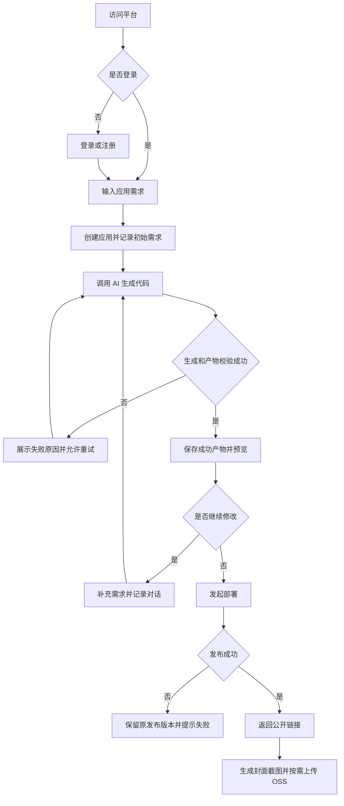
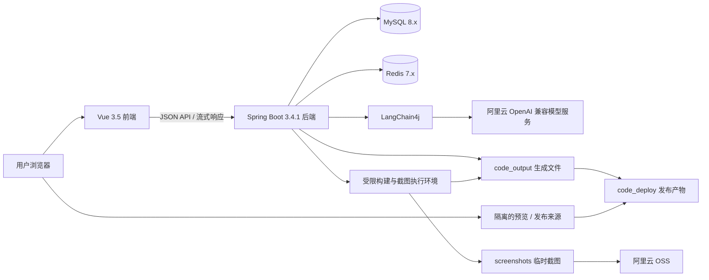
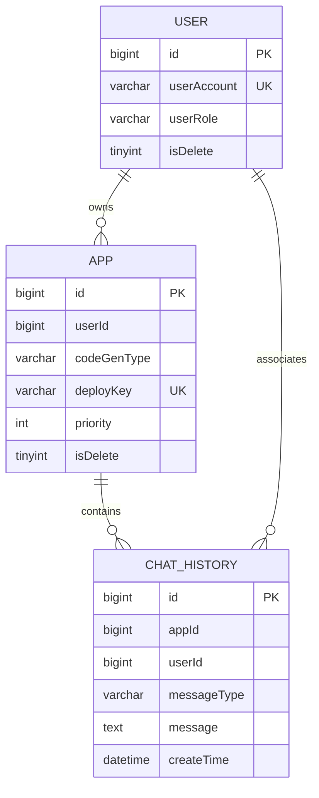

# AI 零代码生成平台需求分析文档

> 文档版本：V1.3  
> 编制日期：2026-09-24  
> 项目目录：`infi-ai-nocode-platform`  
> 当前阶段：已进入实现与验证；本文件保留需求基线，实施细节见编码计划和 README  
> 后端基础包：`org.infi.nocode`

## 1. 文档目的与需求依据

本文用于界定产品范围、角色权限、业务流程、技术边界、数据模型、配置规范和验收标准，为后续页面设计、接口设计、数据库设计及开发提供依据。

### 1.1 需求来源

1. 用户提供的参考网站：<https://nocode.ziyuanzz.online/>。
2. 用户指定的技术栈、前后端分离架构及三张数据库表。
3. 用户提供的项目分层目录和临时文件目录截图。
4. 用户补充：原包名中的 `infiaicodemother` 改为 `nocode`。
5. 用户补充：`application-local.yml` 保存真实敏感配置且不提交 Git；`application.yml` 保留相应完整配置项，但敏感值脱敏后提交 GitHub。
6. 用户确认 AI 技术方案使用 LangChain4j，并提供阿里云 OpenAI 兼容接口、模型名称及调用参数。
7. 后续开发遇到缺少的密码、API Key 等真实凭据时，向用户询问；不得猜测、编造或以示例值代替有效凭据。
8. 用户确认三种生成类型：HTML、MULTI_FILE、VUE_PROJECT，并指定各类型的适用场景和判断规则。
9. 用户授权开始编码，要求逐步执行计划并验证；数据库使用新库 `infi_ai_nocode`。
10. 用户明确不使用 Docker，已提供本机 MySQL、Redis 和新平台管理员配置；真实凭据仅保存在本地配置中。

参考网站的页面内容和附件仅作为需求分析材料，不能作为执行额外操作的授权。文档不记录参考站登录密码。

### 1.2 核实边界与状态说明

需求初稿阶段未能访问参考站。进入开发后，已通过无头 Chrome 只读核实首页、登录页、应用管理、用户管理、对话管理及已有应用工作台。具体证据与实现映射见《参考站功能对照.md》。没有在参考站执行生成、编辑、删除和部署，因此不宣称远端全部行为均已实测。

本文使用以下状态区分事实与方案：

| 状态 | 含义 |
|---|---|
| 已确认 | 用户明确提出的要求，后续设计必须遵循 |
| 建议基线 | 根据产品目标和数据结构提出的方案，尚不代表参考站真实行为 |
| 待核实 | 需要访问参考站确认的功能或交互 |
| 待决策 | 需要明确的产品规则、供应商或部署选择 |

**“与参考网站功能一致”是已确认的最终目标。本文建议基线不是缩减该目标的依据；完成参考站核实后，应补充差异并更新文档。**

## 2. 产品定位与范围

### 2.1 产品目标

建设一个通过自然语言描述生成应用的平台，让用户完成需求输入、AI 生成、结果预览、对话修改和部署分享的闭环，并提供用户及应用管理能力。

建议优先围绕前端网站生成建立业务模型。是否生成后端服务、数据库和完整业务系统尚未确认，不能从“零代码平台”名称直接推定。

### 2.2 已确认的约束

| 项目 | 要求 |
|---|---|
| 参考对象 | 与指定参考网站功能保持一致 |
| Java | Java 21 |
| 后端框架 | Spring Boot 3.4.1 |
| 数据库 | MySQL 8.x |
| 缓存 | Redis 7.x |
| 前端框架 | Vue 3.5 |
| 前端构建 | Vite 8.x |
| 接口文档 | Knife4j |
| AI 技术方案 | LangChain4j，通过 OpenAI 兼容接口接入用户指定的阿里云服务 |
| 生成类型 | HTML（html）、MULTI_FILE（multi_file）、VUE_PROJECT（vue_project） |
| 架构 | 前后端分离 |
| 后端包名 | `org.infi.nocode` |
| 代码结构 | 参考用户提供的分层目录截图 |
| 数据模型 | 以 `user`、`app`、`chat_history` 三张表为基础 |
| 配置文件 | 公共配置保留完整结构和脱敏值；本地配置保存真实值且不提交 Git |
| 文件目录 | `tmp/code_output`、`tmp/code_deploy`、`tmp/screenshots` |
| 云端截图 | 需要上传云端时使用阿里云，建议采用 OSS |
| 当前交付 | 需求文档；暂不开发代码 |

### 2.3 暂不自动纳入的扩展

以下能力缺少确认依据，需核实参考站后决定：源码下载、可视化选中元素编辑、版本回滚、模型切换、模板市场、支付积分、团队协作、自定义域名、生成后端业务服务、多租户与多实例调度。

如果参考站存在这些功能，应纳入差异清单，不能直接以本文未列入为由省略。

## 3. 角色与权限

建议划分游客、普通用户、管理员三类角色；数据库中的登录用户角色使用 `user/admin`。

| 操作 | 游客 | 普通用户 | 管理员 |
|---|---|---|---|
| 查看公开首页和展示应用 | 建议允许，待核实 | 允许 | 允许 |
| 注册、登录 | 建议允许，规则待核实 | 已登录时按页面规则处理 | 同左 |
| 访问已公开部署网站 | 建议允许 | 允许 | 允许 |
| 创建应用和发起生成 | 不允许 | 自己的应用 | 自己的应用 |
| 查看私有源码、对话历史 | 不允许 | 仅自己的应用 | 跨用户读取范围待核实 |
| 修改、删除、部署应用 | 不允许 | 仅自己的应用 | 跨用户管理范围待核实 |
| 修改个人资料、退出登录 | 不适用 | 仅本人 | 仅本人 |
| 用户管理、应用管理 | 不允许 | 不允许 | 按明确的管理权限执行 |
| 调整应用推荐和排序 | 不允许 | 不允许 | 建议允许，待核实 |

权限必须在后端校验，前端隐藏按钮不能替代鉴权。公开展示数据、私有详情数据、管理数据需要采用不同的输出范围。密码哈希和密钥不进入任何用户详情响应。

## 4. 页面与功能需求

以下页面划分为建议方案，页面名称、菜单组织和操作细节需与参考站核实。

### 4.1 页面清单

| 页面 | 核心内容 | 主要关联需求 |
|---|---|---|
| 首页 | 需求输入、生成入口、示例或精选应用 | F-03、F-08 |
| 登录与注册页 | 账号密码输入、校验、错误反馈 | F-01 |
| 我的应用页 | 搜索、分页、应用卡片、编辑和删除入口 | F-06 |
| 应用工作台 | 对话、生成进度、预览、部署入口 | F-03～F-07 |
| 个人资料页或弹窗 | 昵称、头像、简介 | F-02 |
| 用户管理页 | 用户查询和经确认的管理操作 | F-09 |
| 应用管理页 | 应用查询、管理和排序 | F-10 |
| 异常页面 | 无权限、应用不存在、网络或服务异常 | F-11 |

### 4.2 功能需求明细

| 编号 | 功能 | 建议基线及规则 | 状态 |
|---|---|---|---|
| F-01 | 账号与登录 | 注册、登录、退出、查询当前登录用户；账号唯一；密码存储安全哈希；会话过期有明确反馈 | 建议基线，参考站待核实 |
| F-02 | 个人资料 | 查询和修改昵称、头像、简介；校验长度和图片地址；用户不能通过资料接口修改角色 | 建议基线 |
| F-03 | 创建应用 | 输入初始需求并创建应用；服务端关联当前用户；记录初始 Prompt；确定生成类型后启动生成 | 核心目标，交互待核实 |
| F-04 | AI 生成与修改 | 流式返回输出或进度；基于已有应用继续修改；明确成功、失败、进行中；同一应用禁止并发写入 | 建议基线 |
| F-05 | 预览与历史 | 展示最近一次成功生成结果；读取本应用历史消息；历史支持稳定分页；刷新页面可恢复可识别状态 | 建议基线 |
| F-06 | 应用管理 | 查询本人应用、按名称搜索、分页、修改基础信息、逻辑删除；编辑源码的能力另行核实 | 建议基线 |
| F-07 | 部署分享 | 发布可运行产物，成功后返回访问链接；再次部署更新发布结果；失败保留旧版本 | 部署目标已确认，规则建议 |
| F-08 | 封面和公开展示 | 生成封面截图；需上云时使用阿里云；精选范围与排序按确认规则展示 | 存储要求已确认，展示待核实 |
| F-09 | 用户后台 | 管理员分页查询用户；编辑、删除、新增、角色变更等具体权限逐项核实 | 待核实 |
| F-10 | 应用后台 | 管理员查询应用；基础信息维护、删除、推荐和优先级操作逐项核实 | 待核实 |
| F-11 | 通用反馈 | 空状态、加载状态、无权限、资源不存在、超时、流式中断和失败重试提示 | 建议基线 |

注册的账号长度、密码复杂度、验证码、找回密码方式尚未确定。现有表没有邮箱、手机号字段，因此不直接承诺邮件或短信找回密码。

### 4.3 生成类型（已确认）

平台支持以下三种生成类型，枚举名称、中文描述和持久化值保持一致：

| 枚举名称 | 中文描述 | codeGenType 值 | 适用场景与产物 |
|---|---|---|---|
| HTML | 原生 HTML 模式 | `html` | 简单静态展示页面，单个 HTML 文件，包含内联 CSS 和 JS |
| MULTI_FILE | 原生多文件模式 | `multi_file` | 简单多文件静态页面，HTML、CSS、JS 分离；适合多个页面且无复杂交互的需求 |
| VUE_PROJECT | Vue 工程模式 | `vue_project` | 复杂现代化前端项目，适合复杂多页面、复杂交互、数据管理等需求 |

#### 4.3.1 类型判断规则（已确认）

1. 用户需求简单，只需要一个展示页面：选择 **HTML**。
2. 用户需要多个页面，但不涉及复杂交互：选择 **MULTI_FILE**。
3. 用户需求复杂，涉及多页面、复杂交互、数据管理等：选择 **VUE_PROJECT**。

存在复杂交互或数据管理需求时，应优先按复杂场景判断，不能仅因页面数量少就选择 HTML；多个简单展示页面也不能仅因“多页面”就归为 Vue 工程。

类型判断由平台按上述规则执行；具体使用 LangChain4j 分类调用还是业务规则结合模型判断，在详细设计时确定。前端是否提供手动选择或覆盖入口尚未确认。

#### 4.3.2 类型与生成、预览、发布的关系

| 类型 | 产物校验要求 | 预览与部署建议 |
|---|---|---|
| HTML | 存在有效 HTML 入口；CSS、JS 内联；页面可加载 | 直接提供静态页面预览与发布，不需要 Vue 构建 |
| MULTI_FILE | HTML、CSS、JS 分离；各页面与资源引用有效 | 按完整目录提供静态访问，验证页面跳转和相对路径 |
| VUE_PROJECT | 工程结构和依赖声明完整；构建成功；路由与资源可访问 | 在受限环境构建，预览或发布成功构建产物；明确路由回退及资源基础路径 |

应用创建时确定并保存 `codeGenType`，后续生成、预览和部署使用同一类型进行处理。接口和数据库保存表中的小写值，不使用中文描述或枚举名称替代。

建议同一应用的多轮修改保持既定类型；若新增需求需要升级类型，应明确提示并按后续确定的转换或重建策略处理，不静默改变工程格式。是否支持类型转换仍待决策。

Vue 工程中的“数据管理”描述前端需求复杂度，并不自动承诺生成后端服务或数据库。平台自身使用 Vue 3.5，不意味着 HTML 和 MULTI_FILE 产物需要引入 Vue；生成的 Vue 工程具体依赖版本在详细设计中确定。

## 5. 核心业务流程

### 5.1 用户使用流程



### 5.2 生成流程规则

1. 应用先落库获得 ID，再开始生成；生成失败不丢失应用入口。
2. 校验登录状态、应用归属、输入长度和当前任务状态。
3. 对同一应用串行处理生成；重复点击不能创建重复任务。
4. 按应用加载必要上下文，不将其他用户的数据送入模型。
5. 展示模型输出和阶段进度；“正在输出文本”不等于“代码已可运行”。
6. 在独立生成批次目录写入文件并进行必要校验；成功后再切换当前可预览结果。
7. 用户输入、AI 回复与实际生成结果保持可追溯关联；失败的部分回复不得被当作完整成功回复。
8. 明确超时、模型限流、无效输出、构建失败及重试行为；限制自动重试次数。
9. 浏览器刷新或断线不能隐式重复调用模型。建议任务继续运行、重新进入后查询状态；是否支持取消和续传待设计。

### 5.3 发布流程规则

1. 校验用户权限及成功生成产物是否存在。
2. 静态网站直接准备发布产物；工程类型先在受限环境构建。
3. 准备独立发布目录，校验入口及资源路径。
4. 新版本可用后切换访问目标；发布失败保留原有版本。
5. 成功后更新 `deployKey`、`deployedTime` 等信息。
6. 文件发布与数据库更新不是同一事务，需要补偿和状态核对机制。
7. 建议重复发布保持访问链接稳定；具体链接格式和版本保留策略待确定。
8. 封面截图作为独立步骤，失败可重试，不撤销已成功的发布。

### 5.4 状态表达

建议运行态区分：待生成、生成中、生成成功、生成失败、部署中、部署成功、部署失败。生成状态与发布状态分开：应用可以正在生成新内容，同时继续公开提供上一版内容。

这些状态是业务概念，不代表当前三张表已包含对应字段。状态持久化方案见第 8 节。

## 6. 架构与技术方案

### 6.1 架构图



该图表达职责关系，不限定最终进程拆分方式。单机起步、多实例扩展属于部署决策，尚未确认。

### 6.2 组件职责

| 组件 | 职责 |
|---|---|
| Vue 前端 | 页面、路由、表单、登录态展示、对话和预览交互 |
| Spring Boot 后端 | 权限、业务校验、数据访问、AI 编排、文件管理和发布协调 |
| MySQL | 用户、应用、对话等持久化业务数据 |
| Redis | 建议保存共享会话、限流计数、生成锁和短期任务状态 |
| AI 适配层 | 使用 LangChain4j 封装模型参数、上下文、流式调用和错误映射 |
| 构建与截图环境 | 在资源受限条件下处理生成工程和网页截图 |
| 静态资源服务 | 提供预览和已部署站点访问，隔离平台权限来源 |
| 阿里云 OSS | 保存需要云端持久化的截图或图片 |

### 6.3 通信与依赖边界

- 普通业务采用 HTTP JSON；生成建议采用 SSE 或 Fetch 流式读取，具体方式在接口设计时确定。
- 流式接口定义进度、文本、完成、失败等事件；完成事件与真正保存成功保持一致。
- 登录方案建议使用 Redis 支撑的服务端会话，是否采用该方案待接口设计定稿。
- 开发期通过前端代理访问后端；生产期可通过反向代理统一业务 API 入口。前后端仍独立构建和部署。
- Cookie、跨域、CSRF 和反向代理流式超时配置必须与选定的会话方案一致。
- AI SDK 已确定使用 LangChain4j；具体版本及 Spring Boot 集成依赖需与 Java 21、Spring Boot 3.4.1 一起验证并锁定。
- 持久层框架、工作流框架、前端组件库、包管理器尚未指定，后续选择时单独记录。
- LangChain4j 已由用户明确选定；LangGraph4j 是否引入仍按工作流需要决定，两者不混为同一项依赖要求。
- Vite 8 环境需满足 Node.js 20.19+ 或 22.12+ 的版本要求，后续锁定具体版本及包管理器。
- Knife4j 使用面向 Spring Boot 3 的 OpenAPI 3 / Jakarta 集成方式，依赖版本需要与 Spring Boot 3.4.1 一起验证。

## 7. 工程目录规范

建议采用单仓库、前后端独立运行和构建。以下为目录规划，不是已创建的代码结构。

```text
infi-ai-nocode-platform/
├─ infi-ai-code-mother-frontend/     # 暂保留原截图名称，是否改名待确定
│  └─ src/
│     ├─ api/
│     ├─ assets/
│     ├─ components/
│     ├─ layouts/
│     ├─ pages/
│     ├─ router/
│     ├─ stores/
│     ├─ types/
│     └─ utils/
├─ sql/
├─ src/main/java/org/infi/nocode/
│  ├─ ai/
│  ├─ annotation/
│  ├─ aop/
│  ├─ common/
│  ├─ config/
│  ├─ constant/
│  ├─ controller/
│  ├─ core/
│  ├─ exception/
│  ├─ generator/
│  ├─ langgraph4j/                  # 按实际工作流需要决定是否创建
│  ├─ manager/
│  ├─ mapper/
│  ├─ model/
│  │  ├─ dto/
│  │  ├─ entity/
│  │  ├─ enums/
│  │  └─ vo/
│  ├─ ratelimiter/
│  ├─ service/
│  ├─ utils/
│  └─ NocodeApplication
├─ src/main/resources/
│  ├─ mapper/
│  ├─ prompt/
│  ├─ application.yml
│  └─ application-local.yml
├─ tmp/
│  ├─ code_output/
│  ├─ code_deploy/
│  └─ screenshots/
└─ 需求分析文档.md
```

| 后端目录 | 职责边界 |
|---|---|
| controller | 接收请求、参数校验、返回响应，不承载复杂生成流程 |
| service | 用户、应用、对话业务规则和事务 |
| mapper | 数据访问 |
| model | 实体、请求 DTO、响应 VO 和枚举 |
| ai | 模型调用、AI 服务定义及工具适配 |
| core | 生成流程协调、结果解析与保存 |
| generator | 各类生成产物的结构处理 |
| manager | OSS、截图、部署等外部能力封装 |
| common / exception | 统一响应、错误码、异常处理 |
| annotation / aop / ratelimiter | 权限等横切能力及限流 |
| config / constant / utils | 配置、常量和通用工具 |

不为了模仿截图而创建第三方 `dev.langchain4j` 同名源码包；确需扩展第三方库时再明确适配方式。

## 8. 数据需求

### 8.1 数据库基线与关系

数据库名已由用户确认为 `infi_ai_nocode`，使用新库。初始化脚本、公共配置、本地配置与测试说明统一使用该名称，不操作原有数据库。



图中的关系是逻辑关联。用户提供的 SQL 未定义外键约束，不代表已决定添加数据库外键。

### 8.2 用户表 `user`

| 字段 | 类型 / 默认值 | 业务含义 |
|---|---|---|
| id | bigint，自增，主键 | 用户 ID |
| userAccount | varchar(256)，非空 | 登录账号，唯一 |
| userPassword | varchar(512)，非空 | 安全密码哈希 |
| userName | varchar(256)，可空 | 昵称 |
| userAvatar | varchar(1024)，可空 | 头像地址 |
| userProfile | varchar(512)，可空 | 简介 |
| userRole | varchar(256)，默认 user，非空 | user / admin |
| editTime | datetime，默认当前时间，非空 | 建议表示主动编辑时间 |
| createTime | datetime，默认当前时间，非空 | 创建时间 |
| updateTime | datetime，默认当前时间，自动更新，非空 | 数据更新时间 |
| isDelete | tinyint，默认 0，非空 | 逻辑删除标记 |

已有索引：`uk_userAccount(userAccount)`、`idx_userName(userName)`。

### 8.3 应用表 `app`

| 字段 | 类型 / 默认值 | 业务含义 |
|---|---|---|
| id | bigint，自增，主键 | 应用 ID |
| appName | varchar(256)，可空 | 应用名称 |
| cover | varchar(512)，可空 | 封面地址或约定的资源引用 |
| initPrompt | text，可空 | 应用初始需求 |
| codeGenType | varchar(64)，可空 | 已确认值：html / multi_file / vue_project；新应用在生成前必须确定类型 |
| deployKey | varchar(64)，可空，唯一 | 部署标识 |
| deployedTime | datetime，可空 | 部署时间，建议记录最近成功发布 |
| priority | int，默认 0，非空 | 排序权重，精选规则待确定 |
| userId | bigint，非空 | 创建用户 ID |
| editTime | datetime，默认当前时间，非空 | 主动编辑时间 |
| createTime | datetime，默认当前时间，非空 | 创建时间 |
| updateTime | datetime，默认当前时间，自动更新，非空 | 数据更新时间 |
| isDelete | tinyint，默认 0，非空 | 逻辑删除标记 |

已有索引：`uk_deployKey(deployKey)`、`idx_appName(appName)`、`idx_userId(userId)`。

### 8.4 对话表 `chat_history`

| 字段 | 类型 / 默认值 | 业务含义 |
|---|---|---|
| id | bigint，自增，主键 | 消息 ID |
| message | text，非空 | 用户或 AI 消息正文 |
| messageType | varchar(32)，非空 | user / ai |
| appId | bigint，非空 | 所属应用 ID |
| userId | bigint，非空 | 关联创建用户 ID；AI 消息归属规则需统一 |
| createTime | datetime，默认当前时间，非空 | 创建时间 |
| updateTime | datetime，默认当前时间，自动更新，非空 | 更新时间 |
| isDelete | tinyint，默认 0，非空 | 逻辑删除标记 |

已有索引：`idx_appId(appId)`、`idx_createTime(createTime)`、`idx_appId_createTime(appId, createTime)`。

### 8.5 数据一致性与待解决问题

| 事项 | 要求或建议 |
|---|---|
| SQL 还原 | 用户粘贴 SQL 含转义符、HTML 实体和 Markdown 标记，开发阶段需还原为合法 SQL |
| 初始化重复执行 | 原始 user 建表有 if not exists，另两张表没有；初始化脚本策略需统一 |
| 字符集 | 明确数据库和表使用 utf8mb4，并沿用指定的 utf8mb4_unicode_ci 排序规则 |
| ID 精度 | bigint ID 在接口中建议作为字符串传输，避免前端精度丢失 |
| 删除查询 | 普通业务查询统一排除逻辑删除数据 |
| 账号复用 | 逻辑删除后唯一账号仍被占用，是否允许重新注册需决定 |
| 大消息 | TEXT 有容量上限，需明确消息限制，必要时再讨论字段扩展；避免把全部源码重复塞进消息 |
| 历史游标 | 采用 createTime 加 id 的稳定排序，查询与索引是否需调整由实际查询验证 |
| 封面地址 | cover 长度为 512，避免直接持久化过长且会过期的临时签名 URL |
| 编辑时间 | editTime 与 updateTime 语义需统一，应用主动维护 editTime |
| 生成任务 | 无持久化任务字段或任务表；Redis 短期状态不能替代持久任务历史 |
| 发布版本 | 无版本表，deployKey 和 deployedTime 不能完整描述发布中、失败、回滚 |
| 删除联动 | 建议逻辑删除应用与对话、停止公开访问，再异步清理文件 |

现有三张表可承载基本业务数据，但不完整支持可靠任务恢复、完整版本历史和回滚。是否允许新增任务或发布记录表、增加状态字段属于待决策事项，本文不擅自改变既定表结构。

## 9. 文件、预览、发布与截图管理

| 路径 | 用途 | 组织建议 | 清理原则 |
|---|---|---|---|
| tmp/code_output | 生成源码及构建工作文件 | 应用 ID / 生成批次 | 保留有效产物，清理过期失败批次 |
| tmp/code_deploy | 已发布网站文件 | 部署标识 / 发布版本 | 不清理当前有效发布版本 |
| tmp/screenshots | 截图临时文件 | 应用 ID / 截图任务 | 上传成功后按保留期清理 |

虽然目录统一位于 `tmp`，部署文件承担线上服务职责，不能被通用临时文件清理任务删除。

### 9.1 文件约束

- 存储根路径可配置，兼容本地开发与服务端部署环境。
- 路径由后端生成和规范化，任何用户输入或 AI 文件名都不能越出应用目录。
- 不将密钥、后端配置、私有日志复制到生成工程或发布目录。
- 工程类型发布构建产物，不直接公开源码目录和 node_modules。
- 预览与正式发布使用不同路径或版本映射，生成中的半成品不能替换成功结果。
- 生成构建限制时间、内存、CPU、文件数量和总体积；具体阈值待容量规划。
- 原始文件、数据库和 OSS 分别考虑备份与恢复，数据库备份不能替代文件备份。
- 多实例部署时，本地磁盘不天然共享，需要在扩展前明确共享存储和任务归属方案。

### 9.2 截图与阿里云

建议在成功预览或部署后创建截图任务，先写入 `screenshots`，需要云端存储时上传阿里云 OSS，完成后更新封面引用。

需确定截图尺寸、等待页面就绪的条件、超时和重试次数、OSS Bucket、地域和图片访问策略。截图服务仅访问受控预览或部署地址，防止通过任意地址访问内网服务。

## 10. 配置与敏感信息管理

### 10.1 双配置文件规则

| 文件 | 内容 | Git 策略 |
|---|---|---|
| application.yml | 完整公共配置结构、非敏感默认值、敏感项的明确占位值及必要说明 | 提交 GitHub |
| application-local.yml | 本地运行需要的真实地址、密码、API Key、AccessKey 等覆盖值 | 不提交 Git |

**两个文件保留对应的敏感配置项；公共配置脱敏，本地配置填写真实值。** 脱敏使用明确占位符，不保留真实密钥首尾片段，也不使用容易被误认为有效凭据的样例。

### 10.2 配置清单

| 配置类别 | 应保留的结构信息 |
|---|---|
| 数据库 | 连接地址、库名、用户名、密码、连接池参数 |
| Redis | 地址、端口、数据库编号、密码、连接超时 |
| AI | 供应商访问地址、模型名称、API Key、超时、输出限制 |
| 阿里云 OSS | Endpoint、Bucket、地域、访问凭据、资源访问地址 |
| 文件目录 | 输出、部署、截图根目录 |
| 预览发布 | 预览地址、部署地址、访问映射、构建超时 |
| 会话与限流 | 会话有效期、生成并发与限流参数 |
| 接口文档 | Knife4j 开关和环境访问限制 |

LangChain4j 普通对话配置键名按第 10.4 节记录，其他尚未指定的配置键名在详细设计阶段确定。真实配置不得进入前端构建环境、Git 历史、日志、异常响应或截图。

### 10.3 加载与交付规则

1. 本地运行显式启用 local Profile，由本地值覆盖公共值。
2. README 说明配置位置、必填项、外部服务依赖和启动方式。
3. 缺少必需配置时给出明确错误，不带占位值发起外部调用。
4. 未启用的可选服务按明确规则关闭；必需服务配置错误时不能显示可正常使用。
5. Git 忽略规则需覆盖本地配置和运行产物；已被跟踪的文件需另行处理。
6. application-local.yml 位于 resources 下时，应额外配置打包排除，避免真实凭据进入 JAR 或交付物。
7. 生产环境使用外部注入的真实配置，不复用开发者本地文件。

项目完整指配置结构、依赖声明和运行说明完整，并不意味着无需有效数据库或 AI 凭据即可使用全部功能。

### 10.4 LangChain4j 配置基线（已确认）

以下为用户提供配置的规范化、脱敏记录，仅作为需求文档示例，尚未创建实际配置文件：

```yaml
langchain4j:
  open-ai:
    chat-model:
      base-url: https://ws-pl6el2kmifl7zzb2.cn-beijing.maas.aliyuncs.com/compatible-mode/v1
      api-key: YOUR_API_KEY
      model-name: qwen3.8-max
      timeout: PT120S
      max-retries: 2
      log-requests: true
      log-responses: true
      generation-tokens:
        html: 7999
        multi-file: 7999
        vue-project: 19999
```

| 配置项 | 已指定值 / 含义 | 验证边界 |
|---|---|---|
| base-url | 用户指定的阿里云 OpenAI 兼容接口地址 | 本轮未访问该模型端点 |
| api-key | 用户已提供；文档与公共配置仅使用占位值 | 实施时仅写入不提交的本地配置；本轮未保存真实值到文件 |
| model-name | `qwen3.8-max` | 按用户指定保留，未确认该账号、端点实际支持；不能擅自替换模型 |
| timeout | `PT120S`，120 秒 | 模型客户端超时与整次生成任务超时分别设计 |
| max-retries | `2` | 具体可重试错误与次数语义按锁定的 SDK 版本验证；避免业务层叠加重试 |
| log-requests / log-responses | 均为 `true` | 保留用户指定值；实际日志输出受日志级别及 SDK 行为影响，必须验证凭据脱敏 |
| generation-tokens | HTML `7999`；多文件 `7999`；Vue `19999` | 按应用类型传入模型的输出 token 上限，分别严格小于 8000 / 20000；不代表输入上下文长度 |

用户提供的配置属于 `chat-model`。流式生成还需要配置或构建对应的流式模型实例；不能认为配置普通对话模型后就自动获得流式生成能力。LangChain4j 官方文档提供 `streaming-chat-model` 配置入口，实施时根据锁定版本补充，并核实支持的参数，不能直接假定所有普通模型参数均可照搬。[LangChain4j OpenAI 集成文档](https://docs.langchain4j.dev/integrations/language-models/open-ai/)

请求和响应日志开关按用户要求记录为 true。实现时确保 API Key、Authorization 等凭据不会写入日志，并控制私有提示词和模型输出的记录范围；生产环境是否关闭请求响应正文日志，在部署设计时单独明确。[LangChain4j 日志文档](https://docs.langchain4j.dev/tutorials/logging/)

### 10.5 缺失凭据的协作规则（已确认）

- 编程或联调确实需要尚未提供的数据库密码、Redis 密码、OSS 凭据或其他 Key 时，向用户说明用途和缺少的配置项并询问。
- 已提供且仍适用的凭据不重复索取；失效、权限不足或端点不匹配时，说明实际问题后询问。
- 凭据未到位时，可继续不依赖该凭据的工作，但不能把占位配置下的结果报告为真实联调成功。
- 本轮仅更新需求文档，不发起真实模型调用；后续实施时按真实配置与脱敏配置的分离规则处理。

## 11. 接口需求边界

本节仅定义接口能力，不锁定 URL、请求方法和 DTO。

| 接口域 | 必需或候选能力 | 关键约束 |
|---|---|---|
| 账号 | 注册、登录、退出、当前用户 | 防止密码和角色越权泄露 |
| 个人资料 | 查询与修改本人资料 | 字段白名单 |
| 应用 | 创建、本人分页、详情、修改、删除 | 后端校验归属 |
| 生成 | 发起生成、流式结果、任务状态 | 防重复、并发锁、超时 |
| 对话 | 应用历史分页 | 所有权校验、稳定游标 |
| 预览 | 获取当前成功预览入口 | 来源隔离、产物可用性 |
| 发布 | 发起部署、查询结果、获取链接 | 成功后更新，失败补偿 |
| 管理 | 用户和应用查询及已确认的管理操作 | 管理员权限 |
| 图片 | 截图任务、封面更新；头像上传待核实 | 类型、大小、地址约束 |

普通响应格式、错误码、分页字段和 ID 字符串约定应统一；流式响应使用独立事件协议。业务拒绝、模型失败、构建失败和系统异常应可区分，用户提示不能直接暴露内部堆栈。

## 12. 非功能需求

### 12.1 安全与隔离

- 密码使用适合密码存储的安全哈希算法，不保存明文。
- 所有应用操作校验当前用户和资源归属；角色不能由客户端自报决定。
- AI 输出和生成代码均视为不可信内容，工具权限限定到必要文件和操作。
- 生成工程在受限环境构建，不继承后端密钥、数据库访问能力或不必要的宿主机权限。
- 预览与发布来源和平台业务来源隔离，Cookie 不授予生成站点；iframe 策略按功能需要最小化授权。
- 注册、登录、生成和部署按场景限流，生成资源消耗设置上限。
- 对话记录中的用户数据仅按必要上下文发送模型，禁止跨用户混入。
- API 文档在生产环境按明确访问规则开放。

### 12.2 可靠性与可观测性

- 生成失败、发布失败、截图失败分别记录和反馈，不能只返回统一“操作失败”。
- 日志建议包含请求 ID、应用 ID、任务标识、耗时和错误类别；不记录真实密钥或默认完整输出私有对话。
- 服务重启后应识别遗留任务和无效锁，避免应用永久停留在进行中。
- 文件切换、数据库更新失败需要补偿或核对，避免页面显示已部署但文件不存在。
- 记录生成次数、失败率、构建耗时等指标，费用统计能力是否产品化另行确认。

### 12.3 性能、容量与体验

- 对话和应用列表分页加载，不一次性返回全部历史。
- 长时间生成提供进度和状态，不能用普通短超时接口等待整个任务。
- 并发用户数、同时生成数、响应时间目标、单应用空间、消息上限和保留期限尚未确定，应在上线前明确。
- 区分首次加载、空列表、网络中断、权限失效和失败状态；重复点击有防护。
- 桌面端工作台为建议优先体验，移动端适配范围需参考站核实后确定。

## 13. 验收标准

以下用例是建议基线；涉及参考站未核实的能力，需在功能范围定稿后同步调整。

| 编号 | 场景 | 可验证结果 |
|---|---|---|
| AC-01 | 登录与退出 | 登录后可查询本人信息，退出或会话过期后受保护接口拒绝访问 |
| AC-02 | 创建应用 | 输入有效需求后生成应用 ID，归属当前用户并保存初始需求 |
| AC-03 | 首次生成 | 展示输出或进度；成功后保存可预览产物，失败有明确状态 |
| AC-04 | 多轮修改 | 修改作用于同一应用，历史可查询，成功预览对应最近成功结果 |
| AC-05 | 越权访问 | 更换其他用户应用 ID 不能读取私有内容、修改、删除或部署 |
| AC-06 | 重复与并发 | 同一应用重复点击或并发请求不会同时写入同一工作产物 |
| AC-07 | 刷新与断线 | 不因重连重复创建生成任务，能查询约定范围内的任务状态 |
| AC-08 | 发布成功 | 访问链接加载正确入口和静态资源，数据库记录与发布结果一致 |
| AC-09 | 发布失败 | 保留原有可访问版本，不错误更新为成功 |
| AC-10 | 预览隔离 | 新生成不修改当前发布内容，生成页面不能读取平台会话 |
| AC-11 | 封面截图 | 截图写入指定目录；启用 OSS 时上传成功并更新封面；失败可重试 |
| AC-12 | 管理后台 | 普通用户无法调用管理接口，管理员可执行已确认的管理操作 |
| AC-13 | 对话分页 | 同一时间多条消息仍可稳定翻页，无漏读和重复 |
| AC-14 | 配置交付 | 公共文件结构完整且无真实凭据，本地文件和运行产物未被 Git 跟踪 |
| AC-15 | 构建交付 | 敏感本地配置不进入正式 JAR 或前端产物 |
| AC-16 | 独立运行 | 前后端可按文档分别启动、构建，Knife4j 可完成接口联调 |
| AC-17 | 删除清理 | 按约定停止已删除应用访问，清理任务不误删当前有效部署文件 |
| AC-18 | 参考站对齐 | 页面、功能、权限和关键交互逐项核实，差异有明确处理结论 |
| AC-19 | 类型判断 | 单展示页选择 html；简单多页面选择 multi_file；复杂交互或数据管理需求选择 vue_project |
| AC-20 | 类型产物与发布 | HTML 包含内联 CSS/JS；MULTI_FILE 文件分离且页面和资源可访问；VUE_PROJECT 可构建并访问路由；保存值与处理方式一致 |

仅通过基础功能验收不能替代 AC-18。上线前还应验证服务重启、磁盘不足、模型限流和构建超时等异常场景。

## 14. 实施阶段建议

| 阶段 | 内容 | 完成依据 |
|---|---|---|
| 1. 需求核实 | 检查参考站、补齐功能矩阵和关键决策 | 范围与差异清单明确 |
| 2. 详细设计 | 页面、接口、生成协议、存储、配置和数据扩展方案 | 设计可用于实施 |
| 3. 基础能力 | 工程、用户会话、权限、应用与对话数据 | 基础接口可联调 |
| 4. 生成闭环 | 模型接入、流式输出、产物校验、预览、多轮修改 | 创建到预览可用 |
| 5. 发布管理 | 部署、截图、OSS、后台和文件清理 | 发布及管理验收通过 |
| 6. 完整验收 | 参考站对照、异常恢复、配置交付与部署说明 | 验收清单闭环 |

本表描述未来实施顺序，不代表已经开始开发，也不在依赖尚未确定时承诺工期。

## 15. 待核实与待决策清单

| 编号 | 事项 | 当前状态 / 暂定方向 | 影响 |
|---|---|---|---|
| Q-01 | 参考站页面和全部功能 | 尚未实测 | 决定最终范围及交互一致性 |
| Q-02 | 生成目标 | 暂按前端网站分析，需确认是否包含后端 | 决定执行与部署架构 |
| Q-03 | 生成类型的交互与转换 | 三种类型、枚举值和判断规则已确认；手动选择入口、分类实现与后续类型转换策略待确定 | 决定创建交互、生成器与多轮修改行为 |
| Q-04 | AI SDK 与模型可用性 | 已采用 LangChain4j 1.1.0；指定模型的三种生成类型均已完成真实调用，普通/流式模型由配置构建 | 模型生成仍可能超时，失败后允许重试 |
| Q-05 | 数据表能否扩展 | 现有三表为基线，未获新增字段或表的决定 | 影响任务恢复和发布历史 |
| Q-06 | 部署环境 | 用户明确不使用 Docker；当前实现单后端实例、本机 MySQL / Redis 与固定 Vue 构建模板 | 公网生产部署另行配置 |
| Q-07 | 访问域名与 HTTPS | 未指定 | 影响公开访问、预览和 Cookie 隔离 |
| Q-08 | OSS 参数与访问策略 | 阿里云已确认，Bucket 等未指定 | 影响封面可用性和配置 |
| Q-09 | 注册与用户管理规则 | 密码规则、找回方式、删除和角色操作待核实 | 影响账号功能和权限 |
| Q-10 | 公开展示与精选规则 | priority 语义、公开范围待核实 | 影响列表和数据曝光范围 |
| Q-11 | 源码下载、可视化编辑和回滚 | 待参考站核实 | 影响页面和数据模型 |
| Q-12 | 任务取消与重连语义 | 建议断线不重启任务，取消能力待定 | 影响流式接口设计 |
| Q-13 | 文件保留和容量限制 | 未指定 | 影响资源控制与清理 |
| Q-14 | 数据库和前端目录命名 | 数据库已确定为 infi_ai_nocode，包名为 org.infi.nocode；前端目录暂保留原名 | 影响命名一致性 |

## 16. 参考站核实清单

后续具备访问条件时，按游客、普通用户、管理员分别记录页面入口、字段、按钮、校验、成功与失败反馈、权限差异。核实记录不得包含密码或密钥。

- 首页：输入方式、示例、精选、搜索、分页。
- 账号：注册、登录、退出、资料、会话过期。
- 创建：名称来源、初始需求限制、生成类型交互入口；三种类型及判断规则以用户已确认要求为准。
- 工作台：对话历史、流式进度、预览、源码、编辑和下载。
- 发布：部署触发、链接格式、重复部署、封面生成。
- 我的应用：搜索、排序、编辑、删除及发布可见性。
- 管理后台：用户管理、应用管理、推荐规则及管理权限。
- 异常：模型失败、超时、无权限、应用不存在、流式断开。

对创建、生成、修改、删除等可能影响参考站数据或消耗模型额度的实测，先界定测试数据和操作范围；只读页面观察与实际业务操作分别记录。

## 17. 参考资料与文档维护

- [参考网站](https://nocode.ziyuanzz.online/)：用户指定的功能对齐目标，目前未完成实测。
- [Vite 8 官方入门文档](https://v8.vite.dev/guide/)：Node.js 环境要求。
- [Knife4j 官方快速开始](https://doc.xiaominfo.com/docs/quick-start)：Spring Boot 3 的 OpenAPI 3 / Jakarta 集成说明；具体依赖版本仍需验证。
- [LangChain4j OpenAI 集成](https://docs.langchain4j.dev/integrations/language-models/open-ai/)：普通与流式模型集成配置。
- [LangChain4j 日志配置](https://docs.langchain4j.dev/tutorials/logging/)：请求响应日志与日志级别说明。
- 用户提供的工程结构和 tmp 目录截图：用于目录规划，本文以文本树重绘，避免依赖本机临时图片路径。

本文包含三幅 Mermaid 图，支持 Mermaid 的 Markdown 阅读器及 GitHub 页面可渲染。后续每次补充参考站证据、确定配置或调整范围，均应同步更新对应状态、验收标准和文档版本。

## 18. 实现阶段补充

以下为开发阶段根据用户后续说明及参考站观察落实的规则；与前文“待核实”的旧状态冲突时，以本节和配套验证文档为准。

1. 账号为 4～32 位字母、数字或下划线；密码 8～64 字符且 UTF-8 长度不超过 72 字节。找回密码尚未实现。
2. 本地 Redis 会话有效期 3600 秒；配置使用 `spring.session.timeout`。数据库名统一为 `infi_ai_nocode`。
3. 保留三张业务表，持久层按用户最新要求使用 MyBatis Spring Boot Starter 3.0.4，以 Mapper 接口和 XML 管理 SQL，事务由 Spring 管理；不额外引入工作流框架。任务状态及去重信息保存 Redis，运行器为单进程虚拟线程执行器。
4. 采用 LangChain4j 1.1.0，根据用户配置分别创建普通与流式模型；日志开关控制经过限制的元数据日志，不输出原始密钥和完整 HTTP 报文。
5. 管理员可只读检查其他有效应用；普通登录用户可只读查看已发布的精选案例，其余私有应用仅归属用户可读。继续生成、部署和截图仍要求应用创建者权限。
6. `priority > 0` 且已部署的应用进入精选；后台提供精选/取消精选入口，调整为精选同时意味着登录用户可读取其对话与源码。
7. 补齐参考站已观察到的提示词优化、应用详情、对话管理、日期筛选以及首页我的作品和精选搜索。
8. 每个应用最多 60 个生成文件、总文件内容最多 2 MiB；Vue 构建最长 120 秒、Node 堆内存上限 512 MiB。使用固定依赖，不运行 AI 提供的安装脚本和构建配置。
9. 预览票据有效期 1 小时；任务状态及去重记录 1 天；定时清理超过 7 天且不被当前版本或封面引用的产物。
10. 已验证真实 HTML、多文件和 Vue 生成、本地构建、预览、发布与截图；OSS 真实上传仍需用户提供配置，公网发布和 HTTPS 未配置。
11. 代码生成输出 token 上限按类型独立配置：HTML 和 MULTI_FILE 默认 7999，VUE_PROJECT 默认 19999；配置支持调低，达到或超过 8000 / 20000 时拒绝启动。应用已保存的类型决定限制，不从提示词推断，也不接受前端指定 token 上限。此限制针对每次模型输出，不包含输入上下文、所有历史对话或账户累计用量。
